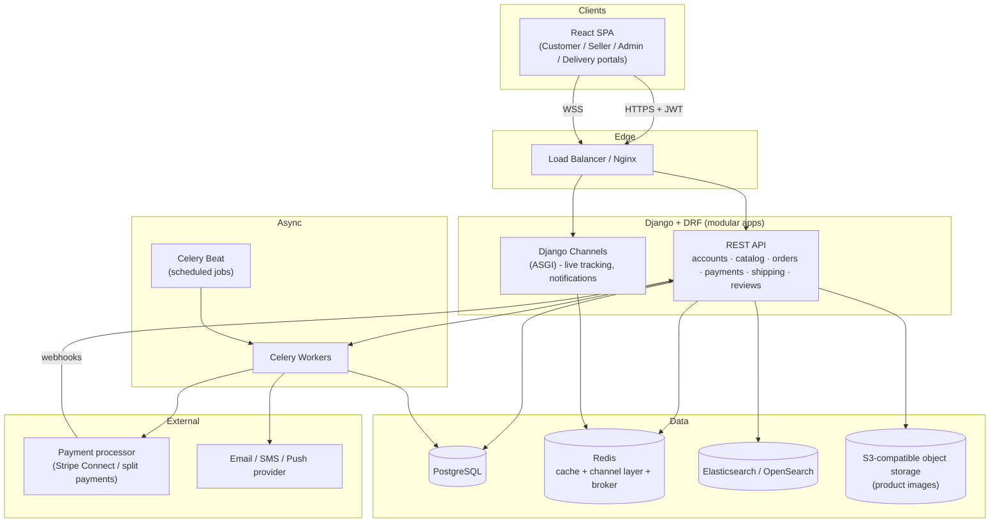
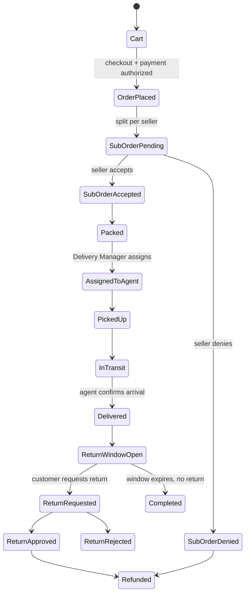

# Multi-Vendor E-Commerce Marketplace
## Full Engineering Specification & Master Build Prompt

**Stack:** React (frontend) · Django + Django REST Framework (backend) · PostgreSQL + pgAdmin (database) · JWT (auth) · Postman (API testing)
**Scale target:** 1,000+ orders/buyers per day · 10,000+ active products · many concurrent seller/customer logins

---

## 0. How to use this document

This is written in two layers:

1. **Sections 1–17** are the actual engineering spec — roles, features, architecture, database, API, security, DevOps. Use this as the source of truth while building.
2. **Section 18 (Master Build Prompt)** is a single, self-contained prompt block that restates everything in imperative form. You can paste that block, on its own, into Claude Code, Cursor, or any AI dev tool to scaffold the whole project — you don't need to paste the rest of the document with it.

---

## 1. Project Overview

A multi-vendor marketplace (an "Amazon/Noon/Daraz-style" platform) where independent sellers open shops, list products, and fulfill orders; customers buy from multiple sellers in one checkout; a delivery organization picks up, transports, and confirms delivery of orders; and a super admin oversees the entire operation with full statistics and control.

Five actors:

| Role | One-line job |
|---|---|
| **Super Admin** | Owns the platform. Creates Admins and Delivery Managers, sees platform-wide statistics and every shop's returns, has final control over everything. |
| **Admin** | Operates the platform day-to-day: approves/removes products, accepts/denies shipments, views statistics. |
| **Seller (Shop Owner)** | Owns a storefront. Uploads products (with images, quantity, category), manages stock, sends orders to delivery, tracks shipments, sees shop-level stats. |
| **Delivery Manager (Delivery Admin)** | Created by Super Admin. Creates and manages Delivery Agent accounts, assigns orders to agents, monitors fleet performance. |
| **Delivery Agent (Delivery Man)** | Has a personal delivery queue with tracking numbers. Picks up, transports, and confirms/scans each delivery on arrival. |
| **Customer** | Browses, buys from one or many sellers in a single cart, pays by card or cash on delivery, tracks shipments, reviews products, keeps a wishlist, follows sellers, and requests returns. |

---

## 2. Industry Patterns Incorporated (Research Summary)

Before writing the spec, current (2026) practice from comparable platforms was reviewed and folded into the design below:

- **Buy-Box / shared catalog model:** Amazon-style marketplaces separate the *canonical product* from *seller offers* — many sellers can list the same product at different prices/stock, and the platform picks (or lets the customer pick) the best offer. This is exactly the "customer searches and sees every seller who has it" requirement, so the catalog is modeled as `Product` (canonical) + `Listing` (per-seller offer), not one Product row per seller.
- **Split payments:** Modern marketplaces route one checkout payment to many sellers automatically (Stripe Connect / PayPal Commerce / Razorpay Route are the standard tools), rather than the platform holding all the money and manually paying sellers out.
- **MACH-style modular backend:** 2026 marketplace architecture guidance favors independently-scalable modules (catalog, search, payments, orders) over one giant tangled app, even inside a single Django project (i.e., separate Django apps with clean boundaries).
- **Event-driven, push-based delivery tracking:** the current pattern for live tracking (used by food/parcel delivery systems) is GPS ping → message queue → cache latest location in Redis → push to customer over WebSocket, rather than the client polling the server.
- **Server-state vs client-state split on the frontend:** the 2026 React consensus is to use a dedicated data-fetching library for anything that comes from the API, and a small store only for pure UI/session state — this avoids the classic bug of manually keeping a Redux/Zustand copy of server data in sync.
- **RMA (Return Merchandise Authorization) as a first-class workflow:** returns are modeled as their own object with a status lifecycle, not just an order flag, so multi-seller orders can have three different return states for three different sellers.
- **Follow/subscribe-to-seller:** treated as a lightweight social-graph feature (customer follows shop → shop's new products and promotions appear in a feed / trigger a notification), similar to seller storefront-follow features on modern marketplaces.

---

## 3. Non-Functional Requirements (Scale)

| Requirement | Target | Design implication |
|---|---|---|
| Daily active buyers | 1,000+ | Stateless API servers behind a load balancer; horizontal scaling |
| Product catalog size | 10,000+ SKUs, growing | DB indexing, pagination everywhere, search engine (not raw SQL `LIKE`) |
| Concurrent logins / checkouts | Hundreds of req/sec at peak | JWT (no server-side session store), Redis caching, connection pooling |
| Image-heavy listings (multiple images/product) | High | Object storage (S3-compatible) + CDN, not database blobs |
| Real-time delivery tracking | Sub-5-second updates | WebSockets (Django Channels) + Redis, not polling |
| Bulk uploads (sellers adding many SKUs at once) | Yes | Async CSV/bulk import via Celery, not synchronous request |
| Availability | 24/7 commerce | Read replicas, health checks, zero-downtime deploys |

---

## 4. Roles & Permission Matrix

| Action | Customer | Seller | Delivery Agent | Delivery Manager | Admin | Super Admin |
|---|:---:|:---:|:---:|:---:|:---:|:---:|
| Register / log in | ✅ | ✅ | ✅ (created for them) | ✅ (created for them) | ✅ (created for them) | ✅ (root) |
| Create Admin accounts | ❌ | ❌ | ❌ | ❌ | ❌ | ✅ |
| Create Delivery Manager accounts | ❌ | ❌ | ❌ | ❌ | ❌ | ✅ |
| Create Delivery Agent accounts | ❌ | ❌ | ❌ | ✅ | ❌ | ✅ |
| Create/open a shop | ❌ | ✅ | ❌ | ❌ | ❌ | ✅ |
| Upload / edit own products | ❌ | ✅ | ❌ | ❌ | ❌ | ✅ |
| Approve / remove **any** product | ❌ | ❌ | ❌ | ❌ | ✅ | ✅ |
| Accept / deny a shipment | ❌ | ✅ (own orders) | ❌ | ❌ | ✅ | ✅ |
| Assign order to a delivery agent | ❌ | ❌ | ❌ | ✅ | ✅ | ✅ |
| Mark a delivery as arrived/completed | ❌ | ❌ | ✅ (own assignment) | ❌ | ❌ | ✅ |
| View own shop statistics | ❌ | ✅ | ❌ | ❌ | ✅ | ✅ |
| View platform-wide statistics | ❌ | ❌ | ❌ | ✅ (delivery KPIs) | ✅ | ✅ |
| View every shop's returns | ❌ | ✅ (own only) | ❌ | ❌ | ✅ | ✅ |
| Buy products, pay, track order | ✅ | ❌ | ❌ | ❌ | ❌ | ❌ |
| Review a product | ✅ (if purchased) | ❌ | ❌ | ❌ | ❌ | ❌ |
| Follow a seller | ✅ | ❌ | ❌ | ❌ | ❌ | ❌ |
| Request a return | ✅ | ❌ | ❌ | ❌ | ❌ | ❌ |

Implementation note: model this with a single `User` table plus a `role` field (`CUSTOMER`, `SELLER`, `DELIVERY_AGENT`, `DELIVERY_MANAGER`, `ADMIN`, `SUPER_ADMIN`) and a matching one-to-one profile table per role (`SellerProfile`, `DeliveryAgentProfile`, etc.) for role-specific fields. Enforce permissions with DRF custom `permissions.BasePermission` classes plus **object-level** checks (e.g., a seller can only edit `Product`s where `product.shop.owner == request.user`).

---

## 5. Feature Specification by Module

### 5.1 Authentication & Accounts
- Register/login as Customer or Seller (self-service); Delivery Agent, Delivery Manager, Admin accounts are created *for* the user by the role above them (never self-registered).
- JWT access + refresh tokens (see §9.1), email/phone verification, password reset.
- Profile: name, avatar, addresses (customer can store multiple shipping addresses), default payment method.

### 5.2 Seller / Shop Management
- A seller creates one **Shop** (storefront): name, logo, banner, description, categories it sells in.
- Product upload: title, description, category (multi-level), price, stock quantity, **multiple images**, attributes/variants (e.g., size, color — the "design" of the product), SKU, status (`draft`, `pending_review`, `live`, `rejected`, `out_of_stock`).
- Bulk upload via CSV/XLSX for sellers adding hundreds/thousands of SKUs at once (async job, seller gets a completion notification + error report for bad rows).
- Order inbox: seller sees incoming orders, **accepts or denies** the shipment for their portion of an order, prints a packing slip/label, hands off to delivery.
- Shop-level dashboard: revenue, orders, best sellers, low-stock alerts, return rate.

### 5.3 Product Catalog ("Buy-Box" model)
- `Product` = canonical catalog entry (title, category, base attributes) — created once, can be shared.
- `Listing` = one seller's offer against a `Product` (their price, their stock, their condition, their images). **Many sellers can attach a Listing to the same Product.**
- Product detail page shows: the "best" listing highlighted (lowest price + good rating, i.e. a buy-box), plus a full "other sellers" list — this directly satisfies "when a customer searches, they see every seller who has it."
- Categories are a self-referential tree (unlimited depth: Electronics → Phones → Smartphones).

### 5.4 Cart, Checkout & Multi-Vendor Orders
- A single cart can hold items from many different sellers.
- On checkout, one **Order** (what the customer sees and pays for) is created, and it is automatically split into one **SubOrder** per seller involved (what each seller and delivery fulfill independently). This is the standard multi-vendor pattern and keeps statuses, shipments, and payouts clean per seller.
- Delivery consolidation option: because the requirement is "the delivery gets all the products when I buy," the delivery layer supports a **multi-stop pickup route** — one Delivery Agent can be assigned the whole Order and pick up from each seller's SubOrder location before doing one drop-off to the customer (the same pattern food-delivery apps use for multi-restaurant orders). This is configurable per city/zone; where sellers ship independently instead, each SubOrder simply gets its own Delivery Agent and tracking number.

### 5.5 Payments
- Supported methods: **Visa/Mastercard (card)**, **Cash on Delivery**.
- Card payments go through a payment processor with marketplace "split payment" support (e.g., Stripe Connect or a regional equivalent) so each seller's share and the platform's commission are divided automatically at the point of payment, instead of the platform collecting everything and paying sellers out manually.
- Cash on Delivery: SubOrder is marked `cod_pending` until the Delivery Agent confirms cash collected on delivery, which then triggers seller payout accounting.
- All payment provider communication is via webhooks (payment succeeded/failed/refunded) — never trust the client for payment status.

### 5.6 Shipping, Delivery Management & Real-Time Tracking
- Delivery Manager creates Delivery Agent accounts, assigns SubOrders to agents, and gets a dispatch board (map of active agents + pending assignments).
- Each assignment gets a **delivery/tracking number**.
- Delivery Agent app/view shows: today's assigned deliveries, route, and a **"mark as picked up / out for delivery / arrived / delivered"** action; delivery is confirmed by the agent (e.g. scanning a code or tapping "delivered" with optional photo/signature proof) — this satisfies "check if it arrived."
- Live GPS location of the agent streams to the customer's tracking page (see §10) so the customer watches the delivery move in real time.

### 5.7 Reviews & Ratings
- Only customers who purchased the item can review it (verified purchase).
- Rating (1–5) + text + optional photos; sellers can publicly respond.
- Aggregate rating rolls up to both the `Listing` (that seller) and the `Product` (overall).

### 5.8 Wishlist / Favorites
- Customer can add any listing to a "Favorites" list, organized by category, for later purchase; simple many-to-many `Favorite(customer, listing)`.

### 5.9 Returns & Refunds (RMA)
- Customer requests a return on a delivered SubOrder within the seller's return window.
- Workflow: `requested → seller_reviewing → approved/rejected → item_in_transit_back → received_by_seller → refunded/exchanged`.
- Super Admin and Admin can see **every shop's** return requests and rates (a specific requirement); sellers only see their own.
- Refund is issued back through the same payment processor (partial or full).

### 5.10 Seller Follow / Subscription
- Customer can "follow" a shop; this powers: (a) a personalized feed of new products from followed shops, and (b) notifications when a followed shop posts a new listing or a sale.
- This is the feature behind "see every seller that [I'm] subscribed with" — the customer's search/browse can be filtered to "shops I follow."

### 5.11 Search & Discovery
- Full-text + faceted search (category, price range, rating, seller, in-stock) across `Product` + `Listing`.
- At 10,000+ SKUs, use a dedicated search engine (Elasticsearch/OpenSearch, or Postgres full-text search as a lighter-weight starting point) rather than raw `ILIKE` queries — reindex asynchronously via Celery whenever a listing changes.

### 5.12 Notifications
- Channels: in-app, email, push (mobile later), optionally SMS for delivery updates.
- Events: order placed/accepted/denied, shipment out for delivery, delivered, return status changes, followed-shop new product, low-stock (seller), payout processed (seller).

### 5.13 Admin & Super Admin Dashboards / Statistics
- Super Admin: platform-wide GMV, order volume, active sellers/customers, top shops, delivery performance, every shop's return rate, ability to create Admin and Delivery Manager accounts.
- Admin: product moderation queue (approve/reject/remove), shipment accept/deny oversight, platform statistics (subset of Super Admin's).
- Delivery Manager: fleet statistics — on-time rate, agent leaderboard, active/idle agents, failed-delivery rate.
- Seller: shop-only version of the same statistics.

---

## 6. System Architecture



- **Start as a modular monolith** (one Django project, cleanly separated apps: `accounts`, `catalog`, `orders`, `payments`, `shipping`, `reviews`, `notifications`, `analytics`). This is the right call at your stated scale (1,000 orders/day, 10k SKUs) — true microservices add operational overhead you don't need yet, but keeping app boundaries clean now means you *can* peel a service out later (e.g., search or payments) without a rewrite.
- pgAdmin connects directly to the PostgreSQL instance for schema inspection/admin queries — it's a DB tool, not part of the runtime request path.

---

## 7. Tech Stack

| Layer | Choice | Why |
|---|---|---|
| Frontend framework | React (Vite) | Fast dev server, standard for SPAs |
| Server-state (API data) | TanStack Query | 2026 consensus tool for anything fetched from the API: caching, retries, pagination, optimistic updates, out of the box |
| Client-state (UI/session only) | Zustand | Small, no boilerplate; used only for things that don't come from the server (auth session, cart-drawer-open, theme) — never store fetched data here |
| Forms & validation | React Hook Form + Zod | Type-safe, minimal re-renders |
| Maps / live tracking UI | Leaflet + OpenStreetMap (or Google Maps if budget allows) | Renders the agent's live position on the customer's tracking page |
| Backend framework | Django + Django REST Framework | Batteries-included, mature admin, huge ecosystem, matches your requested stack |
| Auth | `djangorestframework-simplejwt` | Access + refresh tokens, rotation, blacklist support |
| Database | PostgreSQL | Relational integrity for orders/payments; JSONField for flexible product attributes |
| DB admin | pgAdmin | As requested — connect it to the Postgres instance for schema/queries |
| Cache / broker / channel layer | Redis | One tool, three jobs: DRF cache backend, Celery broker, Django Channels layer |
| Async tasks | Celery + Celery Beat | Bulk imports, emails, statistics rollups, payout batches, scheduled reports |
| Real-time | Django Channels (ASGI) | Live delivery location, live order-status pushes, notification stream |
| Search | Elasticsearch / OpenSearch (or Postgres full-text to start) | Fast faceted search across a growing 10k+ SKU catalog |
| Object storage | S3-compatible (AWS S3 / MinIO for self-host) + CDN | Product images must not live in the DB |
| Payments | Stripe Connect (or regional split-payment provider) + Cash-on-Delivery flow | Native multi-seller payment splitting |
| API testing | Postman (collections per module) + Newman in CI | Matches your requested tool; automatable |
| Containerization | Docker + Docker Compose | Reproducible dev/staging environment |
| Web/app server | Gunicorn/Uvicorn workers behind Nginx | Standard production Django deployment |

---

## 8. Database Design (Core Entities)

Entities and key relationships (not exhaustive field lists — the essentials):

- **User** (`id, email, phone, password_hash, role, is_active, date_joined`)
- **SellerProfile** (`user ⇒ 1:1, shop ⇒ 1:1`)
- **DeliveryAgentProfile** (`user ⇒ 1:1, delivery_manager ⇒ FK, current_lat, current_lng, is_available`)
- **DeliveryManagerProfile** (`user ⇒ 1:1`)
- **Shop** (`owner ⇒ FK User, name, logo, banner, description, is_active, created_at`)
- **Category** (`name, parent ⇒ FK self, slug`) — self-referential tree
- **Product** (`title, description, category ⇒ FK, base_attributes JSONB, created_at`) — canonical catalog entry
- **Listing** (`product ⇒ FK, shop ⇒ FK, price, stock_qty, condition, status, variant_attributes JSONB`) — one seller's offer
- **ProductImage** (`listing ⇒ FK, image_url, sort_order`) — multiple images per listing
- **Cart / CartItem** (`customer ⇒ FK, listing ⇒ FK, quantity`)
- **Order** (`customer ⇒ FK, total_amount, payment_method, status, created_at`) — what the customer pays
- **SubOrder** (`order ⇒ FK, shop ⇒ FK, status [pending/accepted/denied/packed/shipped/delivered/returned], subtotal`) — one per seller
- **SubOrderItem** (`suborder ⇒ FK, listing ⇒ FK, quantity, unit_price`)
- **Payment** (`order ⇒ FK, provider, provider_ref, amount, status, method`)
- **SellerPayout** (`shop ⇒ FK, suborder ⇒ FK, amount, status, paid_at`)
- **DeliveryAssignment** (`suborder ⇒ FK (or order ⇒ FK for multi-stop), agent ⇒ FK, tracking_number, status [assigned/picked_up/in_transit/delivered/failed], assigned_at, delivered_at, proof_image_url`)
- **DeliveryLocationPing** (`assignment ⇒ FK, lat, lng, recorded_at`) — high-write table; consider only persisting periodically and keeping "latest" in Redis
- **Review** (`customer ⇒ FK, listing ⇒ FK, rating, comment, images, created_at`)
- **Favorite** (`customer ⇒ FK, listing ⇒ FK`)
- **ReturnRequest** (`suborder_item ⇒ FK, customer ⇒ FK, reason, status, requested_at, resolved_at`)
- **SellerFollow** (`customer ⇒ FK, shop ⇒ FK, followed_at`)
- **Notification** (`user ⇒ FK, type, payload JSONB, read_at, created_at`)
- **AuditLog** (`actor ⇒ FK, action, target_type, target_id, created_at`) — who approved/denied what, for accountability at Admin/Super Admin level

Indexing priorities at your scale: `Listing(product_id, shop_id)`, `Listing(status, stock_qty)`, `SubOrder(status, shop_id)`, `DeliveryAssignment(agent_id, status)`, and a composite/text index backing search.

---

## 9. Order & Delivery Lifecycle



### 9.1 JWT Auth Flow
1. `POST /api/auth/login/` → returns short-lived **access token** (e.g. 15–60 min) + longer-lived **refresh token** (e.g. 1–7 days), using `djangorestframework-simplejwt`.
2. Every API request sends `Authorization: Bearer <access_token>`.
3. `POST /api/auth/refresh/` exchanges a valid refresh token for a new access token; enable `ROTATE_REFRESH_TOKENS` + the blacklist app so old refresh tokens can't be replayed.
4. Logout / suspicious activity → blacklist the outstanding refresh token.
5. Enforce HTTPS everywhere — a JWT sent over plain HTTP is as good as handing out a password.
6. Encode only `user_id` and `role` in the token payload; never put sensitive data in it (JWTs are signed, not encrypted, and are readable by anyone who has one).

---

## 10. REST API Design (Grouped Endpoints)

```
Auth
  POST   /api/auth/register/customer/
  POST   /api/auth/register/seller/
  POST   /api/auth/login/
  POST   /api/auth/refresh/
  POST   /api/auth/logout/

Users & Roles (Super Admin / Admin only for the create endpoints)
  POST   /api/users/admins/                 -> Super Admin creates an Admin
  POST   /api/users/delivery-managers/       -> Super Admin creates a Delivery Manager
  POST   /api/users/delivery-agents/         -> Delivery Manager creates a Delivery Agent
  GET    /api/users/me/

Shops
  POST   /api/shops/                         -> seller creates their shop
  GET    /api/shops/{id}/
  GET    /api/shops/{id}/stats/
  POST   /api/shops/{id}/follow/             -> customer follows a shop
  DELETE /api/shops/{id}/follow/

Catalog
  GET    /api/categories/
  POST   /api/products/                      -> seller creates canonical product (or attaches to existing)
  POST   /api/listings/                      -> seller creates their offer on a product
  POST   /api/listings/bulk-import/          -> async CSV/XLSX upload
  GET    /api/listings/{id}/
  PATCH  /api/listings/{id}/
  DELETE /api/listings/{id}/                 -> seller removes own listing
  POST   /api/admin/listings/{id}/moderate/  -> Admin/Super Admin approve/reject/remove any listing
  GET    /api/search/?q=&category=&min_price=&max_price=&shop=

Cart & Checkout
  GET    /api/cart/
  POST   /api/cart/items/
  PATCH  /api/cart/items/{id}/
  DELETE /api/cart/items/{id}/
  POST   /api/checkout/                      -> creates Order + SubOrders, initiates payment

Orders
  GET    /api/orders/                        -> customer's orders
  GET    /api/orders/{id}/
  GET    /api/suborders/?shop={id}           -> seller's incoming orders
  POST   /api/suborders/{id}/accept/
  POST   /api/suborders/{id}/deny/
  GET    /api/admin/returns/                 -> Admin/Super Admin: every shop's returns
  POST   /api/returns/                       -> customer requests a return
  POST   /api/returns/{id}/resolve/          -> seller/admin resolves

Payments
  POST   /api/payments/webhook/              -> provider webhook (payment succeeded/failed/refunded)
  GET    /api/payments/{order_id}/status/

Shipping & Delivery
  POST   /api/delivery/assignments/          -> Delivery Manager assigns SubOrder(s) to an agent
  GET    /api/delivery/assignments/mine/     -> agent's queue
  POST   /api/delivery/assignments/{id}/status/   -> picked_up / in_transit / delivered / failed
  GET    /api/delivery/track/{tracking_number}/
  WS     /ws/delivery/{tracking_number}/     -> live location stream to the customer

Reviews & Favorites
  POST   /api/listings/{id}/reviews/
  GET    /api/listings/{id}/reviews/
  POST   /api/favorites/
  GET    /api/favorites/

Notifications
  GET    /api/notifications/
  POST   /api/notifications/{id}/read/

Statistics
  GET    /api/stats/shop/{id}/               -> seller
  GET    /api/stats/delivery/                -> Delivery Manager
  GET    /api/stats/platform/                -> Admin / Super Admin
```

Apply DRF **throttling** (`UserRateThrottle` / `ScopedRateThrottle`) per role — customers browsing need a generous limit, but checkout and login endpoints should be tighter to blunt brute-force/scalper bot traffic at your target volume.

---

## 11. Real-Time Layer (Delivery Tracking)

Pattern: **push, don't poll.**

1. Delivery Agent's device sends a GPS ping periodically (e.g. every 5–10s) to a lightweight endpoint.
2. Backend writes the latest position to **Redis** (short TTL) — this is the "current location," not history.
3. Django Channels, on receiving the ping, publishes it to a channel-layer group named after the tracking number.
4. The customer's browser holds a WebSocket subscribed to that group and receives the update instantly; the map marker animates to the new position.
5. Only persist location history to PostgreSQL at a coarser interval (e.g. every minute, or on status-change events) — a table that gets a row every 5 seconds from every active agent will otherwise grow out of control for no analytical benefit.
6. Apply basic smoothing/sanity-checking on incoming coordinates (reject impossible jumps) before broadcasting, since raw GPS is noisy.

---

## 12. Background Jobs (Celery)

Run via Celery workers + Celery Beat (scheduler), broker = Redis:

- Bulk product import/export (seller uploads a CSV of 1,000 SKUs → processed off the request thread, seller notified when done).
- Sending transactional email/SMS (order confirmed, shipped, delivered, return status).
- Reindexing the search engine when a listing is created/updated/deleted.
- Nightly/hourly statistics rollups (shop dashboards, platform dashboards) so dashboard reads hit a precomputed table/cache instead of aggregating live on every page view.
- Payout batch processing (seller payouts, especially for Cash-on-Delivery orders where funds aren't already split by the payment processor).
- Abandoned-cart / re-engagement notifications, followed-shop new-product digest.

---

## 13. Scalability & Performance Plan

Mapped directly to your stated numbers:

- **1,000+ orders/day, many concurrent logins:** stateless JWT auth (no server-side session store to bottleneck on) + horizontal scaling of Gunicorn/Uvicorn workers behind Nginx/a load balancer; PgBouncer for connection pooling so you don't exhaust Postgres connections as you add app servers.
- **10,000+ products:** never do unindexed/`LIKE`-based search at this size — use the search engine layer (§5.11); paginate every list endpoint; use `select_related`/`prefetch_related` everywhere to avoid N+1 queries on listing/category/shop joins.
- **Read-heavy pages (catalog, product detail):** cache with Redis (view-level or query-level cache with short TTLs), invalidate on write; consider a CDN in front of product images and even static JSON for popular category pages.
- **Write-heavy paths (checkout, GPS pings):** keep these lean — checkout should do the minimum synchronous work (create records, kick off payment) and push everything else (emails, stats, search reindex) to Celery.
- **Scale incrementally, not preemptively:** start on a single well-sized app server + managed Postgres; add Redis caching and read replicas when you actually see the specific bottleneck (measure with query logging/APM before reaching for infrastructure), rather than guessing.

---

## 14. Security Checklist

- HTTPS everywhere; secure, httpOnly cookies if you ever move refresh tokens client-side, otherwise store tokens carefully on the client (be deliberate about XSS exposure if using `localStorage`).
- `djangorestframework-simplejwt` with short access-token lifetime, refresh rotation, and blacklist enabled.
- Per-role DRF permission classes **and** object-level checks (a seller must never be able to edit another seller's listing via a guessed ID).
- Rate limiting/throttling on auth, checkout, and review-submission endpoints.
- Never store raw card numbers — always tokenize through the payment processor (PCI scope stays with them, not you).
- Verify payment-provider webhook signatures before trusting a "payment succeeded" event.
- Input validation on every serializer (DRF serializers handle most of this) — especially bulk import files.
- File upload validation (type/size limits, virus scan if feasible) for product images and return-request photos.
- Audit log for every Admin/Super Admin moderation action (approve/reject/remove product, accept/deny shipment) — this is what makes "sees every shop's returns" and platform statistics trustworthy.

---

## 15. DevOps

`docker-compose.yml` services:

```
web        -> Django + DRF (Gunicorn, or Uvicorn for ASGI/Channels)
frontend   -> React app (Vite dev server locally / static build behind Nginx in prod)
db         -> postgres:16
pgadmin    -> dpage/pgadmin4 (connected to `db`)
redis      -> redis:7
celery     -> celery worker, same image as `web`
celery-beat -> celery beat scheduler
nginx      -> reverse proxy / static & media serving in prod
```

- Separate settings per environment (`local`, `staging`, `production`) via `django-environ`, secrets from environment variables, never committed.
- CI: run backend tests (pytest-django) + a Newman run of the Postman collection against a spun-up test environment on every PR.
- Zero-downtime deploys: run migrations before swapping traffic; keep backward-compatible migrations (additive first, remove old columns in a later deploy).

---

## 16. API Testing Strategy

- One **Postman collection per module** (Auth, Catalog, Orders, Delivery, Payments, Admin) with a shared **environment** holding `base_url`, `access_token`, `refresh_token`.
- Use a Postman **pre-request script** to auto-refresh the access token when expired, and **tests scripts** to assert status codes/schemas and to chain requests (e.g., capture a created `order_id` into an environment variable for the next request).
- Export collections to the repo (`/postman/*.json`) and run them in CI via **Newman** so API contracts are checked on every push, not just manually in the Postman app.
- Maintain separate mock/seed data per role (a seeded Customer, Seller, Delivery Agent, Delivery Manager, Admin, Super Admin) so the collection can exercise every permission boundary in §4.

---

## 17. Suggested Build Roadmap

**Phase 1 — Core marketplace (MVP)**
Auth + roles, Shop + Product/Listing CRUD, categories, cart, checkout (card + COD, no split-payment yet — aggregate to platform account), basic order lifecycle, seller order accept/deny, Admin product moderation, basic seller/platform stats.

**Phase 2 — Delivery**
Delivery Manager + Delivery Agent accounts, assignment flow, tracking numbers, delivered/failed confirmation, Django Channels live tracking.

**Phase 3 — Money at scale**
Payment-processor split payments (per-seller payout on checkout), Cash-on-Delivery payout batching, refunds/RMA workflow.

**Phase 4 — Discovery & retention**
Search engine integration (buy-box style multi-seller results), reviews, favorites, seller-follow + notification feed.

**Phase 5 — Scale hardening**
Caching layer, read replicas, bulk import for sellers, statistics precomputation, load testing to your 1,000 orders/day + 10k SKU targets, security audit.

---

## 18. Master Build Prompt (copy-paste this block on its own)

```
Build a full-stack, multi-vendor e-commerce marketplace.

STACK: React (Vite) frontend using TanStack Query for all server data and
Zustand only for pure client/UI state; Django + Django REST Framework backend;
PostgreSQL as the database (expose it via pgAdmin for admin/dev access);
djangorestframework-simplejwt for authentication (access + refresh tokens,
rotation, blacklist enabled); Redis for caching, Celery broker, and the
Django Channels layer; Celery + Celery Beat for background jobs; Django
Channels (ASGI) for real-time delivery tracking over WebSockets; an
S3-compatible bucket for product images; a payment processor with
marketplace split-payment support (e.g. Stripe Connect) plus a
Cash-on-Delivery flow; Elasticsearch/OpenSearch (or Postgres full-text
search to start) for product search; Docker Compose for local
orchestration; Postman collections (with a Newman CI run) for API testing.

ROLES (implement as a single User model with a `role` field plus a
one-to-one profile table per role, and DRF permission classes that check
both role AND object ownership):
1. Super Admin — creates Admin and Delivery Manager accounts; sees
   platform-wide statistics; sees every shop's return requests; ultimate
   control over all products, shops, and shipments.
2. Admin — approves/rejects/removes any product; accepts or denies any
   shipment; sees platform statistics.
3. Seller (Shop Owner) — creates one shop; uploads products with multiple
   images, quantity, category, and variant attributes; manages stock;
   accepts or denies shipment of their own orders; sees shop-level
   statistics and their own return requests.
4. Delivery Manager — created only by Super Admin; creates Delivery Agent
   accounts; assigns orders to agents; sees fleet/delivery statistics.
5. Delivery Agent — created only by Delivery Manager; has a personal queue
   of assigned deliveries, each with a tracking number; updates status
   (picked up / in transit / delivered / failed) and confirms arrival.
6. Customer — registers/logs in; browses and searches products (search
   must show every seller/listing offering a given product, buy-box
   style); adds items from MULTIPLE different sellers into one cart;
   checks out once (paying by Visa, Mastercard, or Cash on Delivery);
   that single order is automatically split into one sub-order per
   seller for fulfillment while the customer still tracks it as one
   order; can follow/subscribe to sellers to see their new listings;
   reviews products they've purchased; maintains a favorites/wishlist
   list organized by category; has an order history; and can request a
   return on any delivered item.

CATALOG MODEL: separate the canonical Product (title, category, shared
attributes) from a per-seller Listing (price, stock, condition, images,
variant attributes) so multiple sellers can offer the same product —
this is required for the "customer sees every seller for this product"
search behavior.

ORDER MODEL: Order (what the customer pays and tracks) contains one
SubOrder per seller involved (what each seller fulfills and what gets
assigned to delivery); support both (a) independent per-seller shipping
with its own Delivery Agent and tracking number, and (b) an optional
multi-stop pickup route where one Delivery Agent is assigned the whole
Order and picks up from each seller before one drop-off to the customer.

DELIVERY TRACKING: Delivery Agent devices send periodic GPS pings; write
the latest position to Redis; broadcast it over a Django Channels group
keyed by tracking number; the customer's tracking page holds a WebSocket
subscription and renders live movement on a Leaflet/OpenStreetMap map;
persist location history to Postgres only at a coarse interval, not on
every ping.

PAYMENTS: integrate a payment processor that supports splitting one
checkout payment across multiple seller accounts plus a platform
commission automatically; support Cash on Delivery as a first-class
method with its own reconciliation/payout batch job; process all
payment-status changes via verified webhooks, never client-reported
status.

RETURNS: implement Return Merchandise Authorization as its own object
with a status lifecycle (requested → seller_reviewing → approved/
rejected → in_transit_back → received → refunded/exchanged), scoped per
SubOrder-item so a multi-seller order can have independent return states
per seller; Admin/Super Admin can view every shop's returns; sellers see
only their own.

STATISTICS: build role-scoped dashboards — seller sees their shop's
stats; Delivery Manager sees fleet/delivery KPIs; Admin and Super Admin
see platform-wide stats plus every shop's return rate; precompute heavy
aggregates via scheduled Celery jobs rather than aggregating live on
every dashboard load.

SCALE REQUIREMENTS: design for 1,000+ orders/buyers per day and 10,000+
active product listings with room to grow — use pagination and a real
search engine for all catalog browsing (never unindexed LIKE search at
this size), Redis caching for hot read paths, async Celery jobs for bulk
seller CSV/XLSX product imports and all outbound notifications, DRF
request throttling scoped per role (tighter limits on auth/checkout than
on browsing), and connection pooling (e.g. PgBouncer) so the database
tier scales independently of the number of app servers.

SECURITY: enforce HTTPS everywhere; short-lived JWT access tokens with
rotating, blacklist-capable refresh tokens; per-role AND per-object DRF
permissions (a seller can only ever touch their own shop's data, a
delivery agent only their own assignments); verified payment webhook
signatures; never store raw card data; an audit log of every Admin/
Super Admin moderation action (product approval/removal, shipment
accept/deny).

DELIVERABLES: a Docker Compose setup (Django/DRF API, ASGI Channels
service, React frontend, PostgreSQL, pgAdmin, Redis, Celery worker,
Celery Beat, Nginx); a Postman collection per module (Auth, Catalog,
Orders, Delivery, Payments, Admin/Statistics) with a shared environment
and auto-refreshing JWT via a pre-request script, runnable via Newman in
CI; seed data covering all six roles so every permission boundary above
can be exercised end-to-end.

Build it in phases: (1) core catalog/cart/checkout/order lifecycle with
seller accept/deny and Admin moderation, (2) delivery management and
live tracking, (3) split payments and the RMA return workflow, (4)
search, reviews, favorites, and seller-follow, (5) caching/throttling/
bulk-import hardening for the stated scale targets.
```
